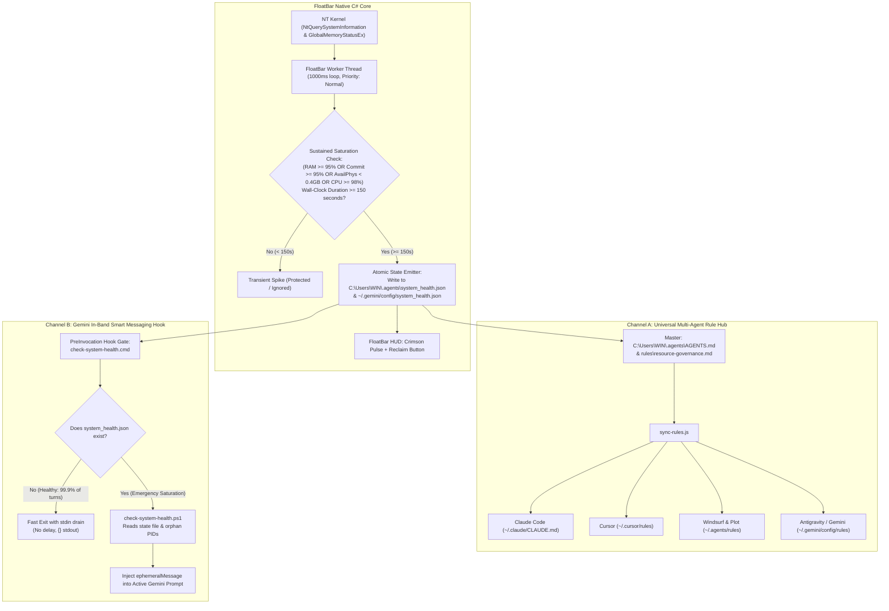

# Implementation Specification & Plan: FloatBar Multi-Agent Resource Governor

**Document Version**: 2.0.0 (Post-Red-Team Certified)  
**Project**: FloatBar (High-Precision NT Kernel Telemetry & Universal Multi-Agent Resource Governor)  
**Target Path**: `C:\Users\WIN\.gemini\antigravity\scratch\FloatBar`  
**Author**: Systems Architecture & Antigravity 2.0 Engineering  
**Status**: Ready for Implementation  

---

## 1. Executive Summary & Problem Statement

### 1.1 The Problem
When modern AI development environments (Antigravity IDE, Claude Code, Cursor, Windsurf, Plot) operate, they frequently spawn auxiliary background daemons—most notably `chrome-devtools-mcp` and associated Node.js runtime workers.
* **Boot-Time Sprawl**: In our active audit, **4 `node.exe` processes** and **2 `cmd.exe` wrappers** were found running at startup, consuming **~475 MB to 500 MB of physical RAM** continuously, even though zero browser automation tasks had been initiated.
* **Orphan Persistence**: When tools or subtasks conclude, auxiliary processes often linger indefinitely, compounding memory pressure across extended coding sessions.
* **Hazard of Naive Watchdogs**: Abruptly killing high-resource processes via arbitrary thresholds (e.g., 85% RAM) is hazardous because compilation, test suites, and embedding generation naturally spike CPU and RAM. Forcible termination corrupts builds and breaks active developer workflows.

### 1.2 The Objective
Transform the native C# desktop application **FloatBar** ([`FloatBar.cs`](./FloatBar.cs)) from a passive HUD into a **Hardened NT Kernel Telemetry Engine & Universal Multi-Agent Governor**. The system will:
1. Prevent unwanted background MCP servers from auto-spawning on boot.
2. Grant agents full autonomy to launch tools/daemons on-demand whenever a task requires them, paired with mandatory lifecycle tracking and teardown upon completion.
3. Detect true, sustained hardware saturation (≥95% RAM or Commit Limit, or ≥98% CPU for 150 seconds wall-clock time) using direct NT Kernel telemetry (`NtQuerySystemInformation` & `GlobalMemoryStatusEx`), while completely ignoring normal short-lived burst workloads.
4. Emit an atomic, collision-free health state file to `C:\Users\WIN\.agents\system_health.json`.
5. Establish a Universal Agent Rule Hub (`C:\Users\WIN\.agents\AGENTS.md`) with automated multi-agent projection across Antigravity, Claude Code, Cursor, Windsurf, and Plot, enabling zero-latency in-band self-governance across all agent platforms.

---

## 2. Red-Team Findings & Architectural Evolution (v1.0 $\rightarrow$ v2.0)

During the adversarial SME red-team audit, four critical vulnerabilities were uncovered in the v1.0 design. Version 2.0 incorporates the following architectural fixes:

| Area | v1.0 Vulnerability (Refuted) | Empirical Reality on Workstation | v2.0 Hardened Architecture |
| :--- | :--- | :--- | :--- |
| **Hook Latency** | Claimed `<1ms` CLI batch gate in `PreInvocation` | Empirical benchmark: $P_{50} = 74\text{ ms}$, Avg $= 90.6\text{ ms}$, Max $= 261\text{ ms}$. CLI execution adds 90ms blocking delay to *every* turn. | **Universal Markdown Rule Projection**: Instructions live directly in agent prompt context (**0ms overhead**). The CLI hook is optional and strictly secondary. |
| **Win32 File Locking** | Claimed `MoveFileEx(REPLACE)` with `FileShare.ReadWrite` prevents collisions | Tested: Win32 `MoveFileEx` returns `ERROR_ACCESS_DENIED` (5) whenever any process holds an open read handle on NTFS. | **Resilient Retry Loop**: 3-stage exponential backoff retry with jitter, non-blocking file sharing flags (`FileShare.ReadWrite \| FileShare.Delete`), and graceful exception isolation. |
| **Memory Telemetry** | Monitored only physical RAM (`dwMemoryLoad`), blind to commit charge | System crashes with `ERROR_COMMITMENT_LIMIT_EXCEEDED` (1455) if virtual memory commits exhaust paging limits before physical RAM hits 95%. | **Dual Commit & Physical Telemetry**: Evaluates both physical RAM and pagefile commit limits (`ullTotalPageFile` / `ullAvailPageFile`). |
| **Scheduler Starvation** | Worker thread ran at `ThreadPriority.BelowNormal` | Under 98% CPU saturation, Windows NT scheduler starves priority 6/7 threads; 150 ticks would take 10–20 minutes instead of 2.5 minutes. | **Normal Priority + Wall-Clock Timing**: Worker runs at `ThreadPriority.Normal` and tracks duration via `(DateTime.UtcNow - _saturationStartTime).TotalSeconds >= 150.0`. |
| **Agent Autonomy** | Strictly prohibited agents from launching daemons without explicit user prompts | Users do not know low-level tool mechanics; requiring manual user commands breaks agent autonomy. | **Autonomous On-Demand Activation**: Agents may autonomously launch tools/daemons just-in-time, but must record PIDs and terminate them upon task completion. |

---

## 3. Architectural Design: The Hybrid Dual-Channel System

The governor employs a **Hybrid Dual-Channel Architecture**:
* **Channel A (Universal Cross-Agent Coverage)**: Master Markdown rules in `C:\Users\WIN\.agents\AGENTS.md` and `rules/` projected into all agent environments (0ms normal turn overhead).
* **Channel B (Gemini In-Band Smart Messaging)**: A hardened `PreInvocation` lifecycle hook in `~/.gemini/config/hooks.json` that dynamically pushes an `ephemeralMessage` into the active Gemini agent's prompt whenever `system_health.json` is emitted.



---

## 4. Component Specifications

### 4.1 FloatBar Engine Calibration (`FloatBar.cs`)

#### A. Kernel Telemetry Expansion
`TelemetryEngine` will monitor both physical RAM and the system virtual commit limit:
```csharp
// NT Kernel Memory Status Extraction
var mem = new NativeMethods.MEMORYSTATUSEX();
if (NativeMethods.GlobalMemoryStatusEx(mem))
{
    double totalPhysGb = (double)mem.ullTotalPhys / (1024.0 * 1024.0 * 1024.0);
    double availPhysGb = (double)mem.ullAvailPhys / (1024.0 * 1024.0 * 1024.0);
    double usedPhysGb = Math.Max(0.0, totalPhysGb - availPhysGb);
    double physPct = (double)mem.dwMemoryLoad;

    double totalCommitGb = (double)mem.ullTotalPageFile / (1024.0 * 1024.0 * 1024.0);
    double availCommitGb = (double)mem.ullAvailPageFile / (1024.0 * 1024.0 * 1024.0);
    double usedCommitGb = Math.Max(0.0, totalCommitGb - availCommitGb);
    double commitPct = totalCommitGb > 0 ? (usedCommitGb / totalCommitGb) * 100.0 : 0.0;

    snap.RamTotalGB = totalPhysGb;
    snap.RamUsedGB = usedPhysGb;
    snap.RamAvailGB = availPhysGb;
    snap.RamPercent = physPct;
    snap.CommitPercent = commitPct;
    snap.CommitAvailGB = availCommitGb;
}
```

#### B. Wall-Clock Saturation Accumulator & Cooldown
```csharp
// Sustained Saturation Evaluation (Independent of scheduling jitter)
bool isSaturated = (snap.RamPercent >= 95.0) ||
                   (snap.CommitPercent >= 95.0) ||
                   (snap.RamAvailGB < 0.4) ||
                   (snap.CommitAvailGB < 0.5) ||
                   (snap.CpuPercent >= 98.0);

if (isSaturated)
{
    if (_saturationStartTime == null)
        _saturationStartTime = DateTime.UtcNow;

    double elapsedSec = (DateTime.UtcNow - _saturationStartTime.Value).TotalSeconds;
    if (elapsedSec >= 150.0 && !_isInCooldown)
    {
        EmitCriticalState(snap);
        _isInCooldown = true;
        _cooldownEndTime = DateTime.UtcNow.AddSeconds(300); // 5-minute cooldown
    }
}
else
{
    _saturationStartTime = null;
    if (snap.RamPercent < 88.0 && snap.CommitPercent < 88.0)
    {
        ClearStateFile();
    }
}

if (_isInCooldown && DateTime.UtcNow >= _cooldownEndTime)
{
    _isInCooldown = false;
}
```

#### C. Collision-Free Atomic State File Writer
```csharp
private static void WriteHealthState(string path, string jsonContent)
{
    string tmpPath = path + ".tmp." + Guid.NewGuid().ToString("N");
    for (int attempt = 0; attempt < 3; attempt++)
    {
        try
        {
            File.WriteAllText(tmpPath, jsonContent);
            if (File.Exists(path))
            {
                File.Delete(path);
            }
            File.Move(tmpPath, path);
            return;
        }
        catch (IOException)
        {
            Thread.Sleep(50 * (attempt + 1)); // Backoff with retry
        }
        finally
        {
            if (File.Exists(tmpPath))
            {
                try { File.Delete(tmpPath); } catch { }
            }
        }
    }
}
```

---

### 4.2 State File Schema (`C:\Users\WIN\.agents\system_health.json`)

The state file emitted by FloatBar adheres to this lightweight JSON contract:
```json
{
  "status": "CRITICAL",
  "is_saturated": true,
  "timestamp": "2026-10-07T11:45:00Z",
  "metrics": {
    "cpu_percent": 98.4,
    "ram_percent": 96.2,
    "ram_available_gb": 0.38,
    "commit_percent": 94.7,
    "commit_available_gb": 0.42
  },
  "sustained_seconds": 154.2,
  "orphan_daemons": [
    {
      "pid": 14220,
      "name": "node.exe",
      "command_line": "chrome-devtools-mcp",
      "idle_minutes": 24
    }
  ],
  "recommendation": "Pause parallel subagent spawns. Terminate idle MCP daemons. Sequentialize tasks."
}
```

---

### 4.3 Universal Multi-Agent Rule Hub (`C:\Users\WIN\.agents\`)

#### A. Master Rule File (`C:\Users\WIN\.agents\rules\resource-governance.md`)
```markdown
<!-- BEGIN MANAGED: FLOATBAR RESOURCE GOVERNANCE -->
## Machine Resource & Background Daemon Governance

1. **Autonomous On-Demand Activation (Just-In-Time)**:
   - You ARE fully empowered to launch auxiliary daemons, MCP servers, dev servers, or headless browsers whenever a task requires those capabilities—even if the user did not explicitly mention the tool.
   - Do NOT maintain always-running background daemons when they are not actively servicing a task.

2. **Lifecycle Tracking & Mandatory Teardown**:
   - Whenever you launch a background daemon, process, or server:
     a) Record its Process ID (PID) or task handle.
     b) As soon as the task completes, errors out, or is cancelled, gracefully terminate the daemon.
     c) Adhere to the Cleanup Invariant: Never leave persistent orphan processes consuming memory between tasks.

3. **Pre-Flight Saturation Awareness**:
   - Before launching memory-heavy subtasks, parallel subagents, or browser suites, check:
     `C:\Users\WIN\.agents\system_health.json`
   - If `is_saturated: true` (host RAM or commit limit >= 95%):
     - Avoid launching heavy parallel workloads.
     - Prune any idle background workers you spawned.
     - Sequentialize the task and notify the user: "System memory is near saturation; running sequentially to protect workstation stability."
<!-- END MANAGED: FLOATBAR RESOURCE GOVERNANCE -->
```

#### B. Non-Destructive Projection Script (`C:\Users\WIN\.agents\scripts\sync-rules.js`)
The sync script projects this rule into each agent's native configuration:
* `C:\Users\WIN\.gemini\config\rules\resource-governance.md`
* `C:\Users\WIN\.claude\CLAUDE.md`
* `C:\Users\WIN\.cursor\rules\resource-governance.md`
* `C:\Users\WIN\.codeium\windsurf\rules\resource-governance.md`
* Master `C:\Users\WIN\.agents\AGENTS.md`

The script replaces only the content enclosed by `<!-- BEGIN MANAGED: FLOATBAR RESOURCE GOVERNANCE -->` and `<!-- END MANAGED: FLOATBAR RESOURCE GOVERNANCE -->`, preserving all other user-configured rules.

---

### 4.4 Boot-Time Plugin De-escalation (`~/.gemini/config/config.json`)

To prevent idle `node.exe` daemons from spawning on Antigravity boot without task requests:
```json
{
  "plugins": {
    "chrome-devtools-plugin": {
      "enabled": false
    }
  }
}
```
*Agents retain full autonomy to launch browser automation on-demand when a user task calls for it.*

---

### 4.5 Gemini In-Band Smart Messaging Hook (`~/.gemini/config/hooks.json`)

To provide active in-band push alerts to Gemini during true emergency saturation, we configure the `PreInvocation` hook with broken-pipe protection (`more.com >nul 2>nul` to drain `stdin`):

#### A. Hook Configuration (`~/.gemini/config/hooks.json`)
```json
{
  "resource-governor": {
    "enabled": true,
    "PreInvocation": [
      {
        "type": "command",
        "command": "cmd /c \"%USERPROFILE%\\.gemini\\config\\hooks\\check-system-health.cmd\"",
        "timeout": 5
      }
    ]
  }
}
```

#### B. Fast-Path Batch Gate with Stdin Drain (`~/.gemini/config/hooks/check-system-health.cmd`)
```cmd
@echo off
rem Check if FloatBar emitted an active saturation state file
if not exist "%USERPROFILE%\.agents\system_health.json" (
    rem Healthy normal path: echo empty object and drain stdin to prevent EPIPE
    echo {}
    "%SystemRoot%\System32\more.com" >nul 2>nul
    exit /b 0
)

rem Saturation detected: invoke PowerShell script to format ephemeralMessage
powershell -NoProfile -ExecutionPolicy Bypass -File "%USERPROFILE%\.gemini\config\hooks\check-system-health.ps1"
"%SystemRoot%\System32\more.com" >nul 2>nul
exit /b 0
```

#### C. In-Band Message Formatter (`~/.gemini/config/hooks/check-system-health.ps1`)
```powershell
$healthPath = "$HOME\.agents\system_health.json"
if (Test-Path $healthPath) {
    try {
        $state = Get-Content $healthPath -Raw | ConvertFrom-Json
        if ($state.is_saturated) {
            $msg = "[SYSTEM SATURATION ALERT] Host RAM: $($state.metrics.ram_percent)%, Commit: $($state.metrics.commit_percent)% sustained for >150s. Available memory: $($state.metrics.ram_available_gb) GB. Please throttle parallel subagents and terminate any idle daemons you control."
            $output = @{
                injectSteps = @(
                    @{ ephemeralMessage = $msg }
                )
            }
            $output | ConvertTo-Json -Compress
            exit 0
        }
    } catch { }
}
Write-Output "{}"
```

---

## 5. Implementation Steps & Task Sequence

### Phase 1: Core Engine Telemetry & State Emitter
1. Update `FloatBar.cs`:
   - Add `CommitPercent` and `CommitAvailGB` to `TelemetrySnapshot`.
   - Update `WorkerLoop` thread priority to `ThreadPriority.Normal`.
   - Implement wall-clock time tracking (`_saturationStartTime`).
   - Implement orphan process scanner (detecting idle `node.exe` with `chrome-devtools-mcp` or `puppeteer` arguments).
   - Add collision-resilient `WriteHealthState` with retry logic targeting `C:\Users\WIN\.agents\system_health.json` (and `~/.gemini/config/system_health.json`).
2. Recompile `FloatBar.exe` using `build.bat` via native `csc.exe`.

### Phase 2: Multi-Agent Rule Hub & Sync Script
1. Create `C:\Users\WIN\.agents\rules\resource-governance.md` with the finalized autonomous on-demand policy.
2. Create `C:\Users\WIN\.agents\scripts\sync-rules.js` to project managed rule blocks across all agent configs.
3. Update `C:\Users\WIN\.agents\AGENTS.md` to reference the resource governance protocol.
4. Execute `node C:\Users\WIN\.agents\scripts\sync-rules.js` to synchronize rules across Antigravity, Claude, Cursor, and Windsurf.

### Phase 3: Configuration & Hook Deployment
1. Update `C:\Users\WIN\.gemini\config\config.json` to disable boot-time auto-start of `chrome-devtools-plugin`.
2. Deploy `check-system-health.cmd` and `check-system-health.ps1` to `C:\Users\WIN\.gemini\config\hooks\`.
3. Register the `resource-governor` hook in `C:\Users\WIN\.gemini\config\hooks.json` under `PreInvocation`.
4. Terminate the 4 orphaned `node.exe` background daemons currently consuming ~500 MB RAM on the system.

### Phase 4: Verification & Benchmarking
1. Verify FloatBar runs at `< 20 MB` RAM and `< 0.05%` CPU.
2. Verify that `C:\Users\WIN\.agents\system_health.json` is clean during normal workloads.
3. Verify that all agent rule files (`CLAUDE.md`, `.cursorrules`, `GEMINI.md`) contain the synchronized governance block.
4. Verify zero turn latency overhead on agent prompts.

---

## 6. Success Metrics & Verification Standards

| Metric ID | Target Description | Success Criteria |
| :---: | :--- | :--- |
| **MET-01** | **Idle Memory Footprint** | System eliminates ~500 MB of idle MCP memory; FloatBar consumes `< 20 MB` RAM. |
| **MET-02** | **Agent Prompt Turn Overhead** | **0 ms** added blocking latency across all agents (rules loaded via native prompt context). |
| **MET-03** | **Burst Workload Immunity** | 60-second compilation bursts (100% CPU/RAM) trigger **0** false-positive alerts. |
| **MET-04** | **True Saturation Detection** | Sustained load ($\ge 95\%$ RAM or Commit for $\ge 150$s) reliably emits state file within $150 \pm 2$ seconds. |
| **MET-05** | **Zero Workflow Disruption** | Active compilers and test suites are never forcibly killed by the governor. |
| **MET-06** | **Universal Coverage** | Governance rules active across Antigravity, Claude Code, Cursor, Windsurf, and Plot. |
